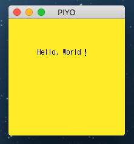
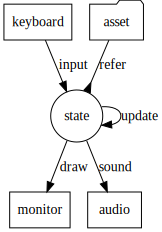

# Piyo🐤

Haskell game engine like fantasy console.
Inspired by PICO-8.


NOTE: UNDER DEVELOPMENT

## Feature

- minimum but simple api
- pure update funciton
- japanease bitmap font support

It supports PICO-8 like drawing api.

## Assuming Specification

For now below.

- display: 192x192
- sprite size: 12x12
- map size: 16x16

## Requirements

SDL2 needed.

### For OS X

Install middle wares with homebrew.
```
brew install sdl2 sdl2_gfx sdl2_image sdl2_mixer sdl2_ttf
```

### For others

It may work ..!

## Minimal code

```haskell
import Piyo

instance Game () where
    draw _ =
        [ cls Yellow
        , txt Black "Hello, World！" 48 48
        ]

main :: IO ()
main = piyo () Nothing
```



## Data Flow Schematic

Functions are called in order update, draw, sound every frame.



## Indexing

Index number starts with 0. Not 1.

## Examples

Sample working code at [Examples](examples)

## Development in the future

- Redesign assets format
- Enrich sound api
- Add useful state update functions
- FPS management
- Support ore key action
- Sprite and map editor
- Export function for distribution
- etc...